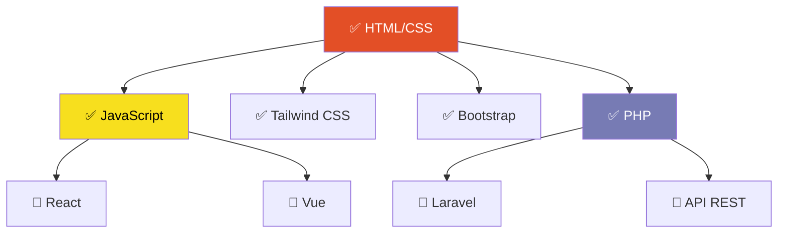

# 👋 ¡Hola, soy Lucía!

### 👩‍💻 Estudiante de DAW - Desarrollo de Aplicaciones Web 💻

  

---

## 🚀 Sobre mí

Actualmente estoy formándome en **Desarrollo de Aplicaciones Web (DAW)**. Me encanta crear interfaces intuitivas, aprender nuevas tecnologías cada día y con ello seguir estudiando y adquiriendo experiencias en diferentes campos.

Disfruto tanto del **desarrollo frontend** como del **backend**, trabajando con JavaScript y PHP para construir aplicaciones web completas y funcionales.

- 🌱 Actualmente aprendiendo: **React, PHP, Vue y Laravel**
- 💡 Interesada en: **Desarrollo Frontend y Backend**
- 🎯 Objetivo: Convertirme en desarrolladora full-stack

---

## 🛠️ Herramientas y Entorno de Desarrollo

---

## 🎯 Roadmap de Aprendizaje 2025

## 📈 Actividad Reciente

<!--START_SECTION:activity-->
<!--END_SECTION:activity-->

---

## 📫 Contacto

---

  
### ⭐ ¡Gracias por visitar mi perfil! ⭐

